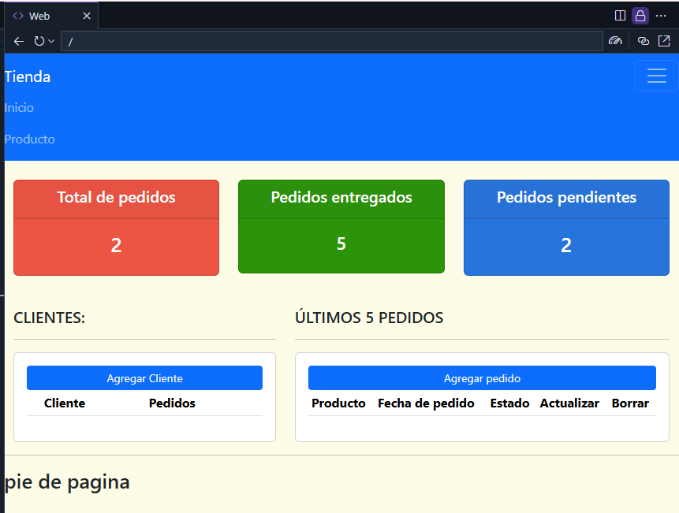

## Introducción al framework Django
Django es un popular framework web utilizado por desarrolladores de todo el mundo para crear aplicaciones web de forma rápida y eficiente. Fue creado en 2003 por Adrian Holovaty y Simon Willison, y desde entonces se ha convertido en uno de los frameworks web más utilizados del mundo. Django es un framework de alto nivel escrito en Python, conocido por su sencillez y facilidad de uso.

## Historia del framework Django
Django fue creado en 2003 por Adrian Holovaty y Simon Willison mientras trabajaban en un sitio web de noticias llamado Lawrence.com. Necesitaban un framework que les permitiera crear aplicaciones web de forma rápida y eficiente, y decidieron crear el suyo propio. Django se publicó como proyecto de código abierto en 2005, y desde entonces se ha convertido en uno de los marcos web más utilizados del mundo.

## Cómo funciona el framework Django
Django se basa en el patrón arquitectónico Modelo-Vista-Controlador (MVC), que separa el código en tres componentes principales: el modelo, la vista y el controlador.

## MVT
Django utiliza un patrón arquitectónico similar llamado Modelo-Vista-Plantilla (MVT), que separa el código en tres componentes principales: el modelo, la vista y la plantilla. El modelo contiene los datos y la lógica de negocio, la vista contiene la interfaz de usuario, y la plantilla contiene el código HTML que se utiliza para mostrar los datos al usuario.

## URLs
Django también utiliza un sistema de enrutamiento de URLs que asigna URLs a vistas, lo que permite a los desarrolladores crear URLs limpias y legibles para sus aplicaciones web. El sistema de enrutamiento de URL de Django es muy flexible y puede personalizarse para adaptarse a las necesidades de cualquier proyecto.

## Vistas, plantillas y URLs de Django

Las vistas de Django son responsables de gestionar las peticiones HTTP y devolver las respuestas HTTP. Una vista es una función Python que toma un objeto de petición como argumento y devuelve una respuesta HTTP. Las plantillas de Django se utilizan para generar código HTML que se devuelve al navegador web del usuario. Las plantillas de Django están escritas en HTML y pueden contener etiquetas de plantilla especiales que permiten insertar contenido dinámico en el HTML.

Las URLs de Django se usan para mapear URLs a vistas. Las URLs se definen en un archivo de enrutamiento URL, que mapea un patrón URL a una función de vista. Las URLs de Django son muy flexibles y pueden personalizarse para adaptarse a las necesidades de cualquier proyecto.
## Ejemplo 1

## Ejemplo 2

