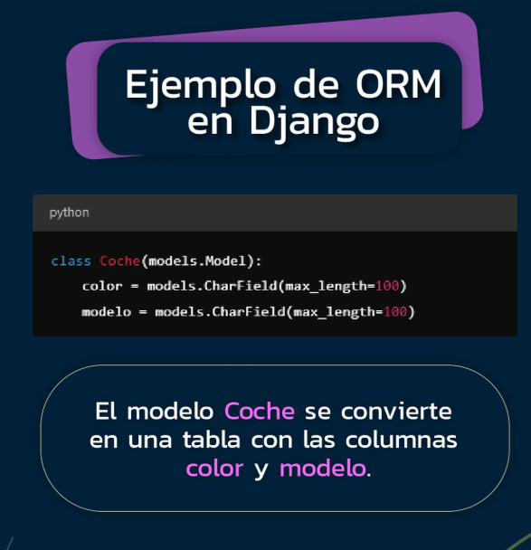
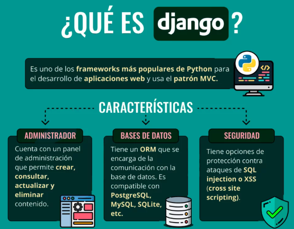
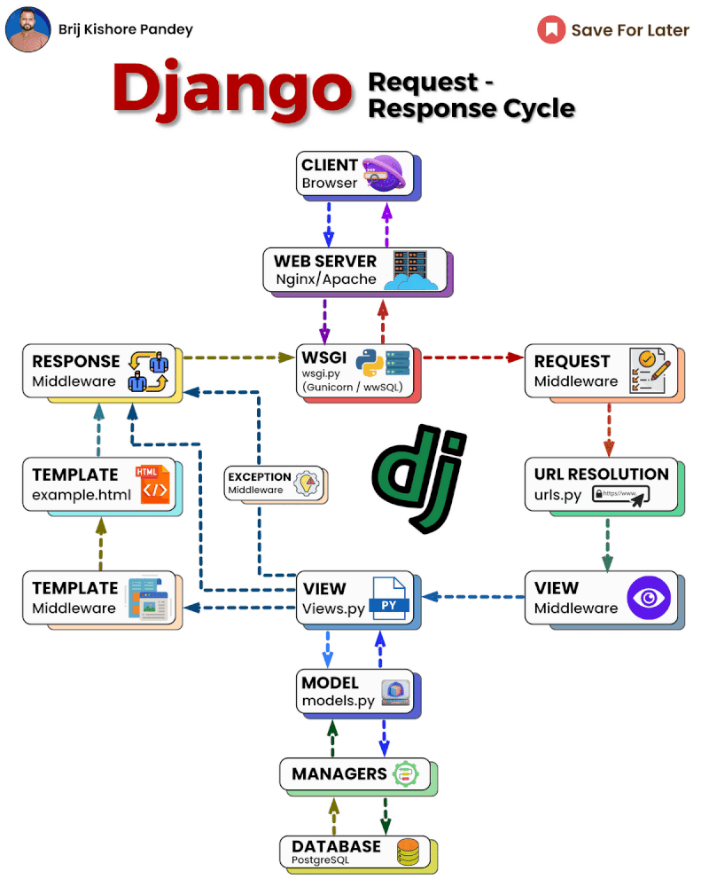

## Material de referencia
- Trabajando con modelos y tablas

[Customize the Django Admin With Python](https://realpython.com/customize-django-admin-python/)

# para entrar al panel
[Web View Django Project Template Error](https://community.idx.dev/t/web-view-django-project-template-error/136/3)

# Agregar la extencion SQLite Viewer en vscode

# modelos ejemplo en github

## videos
[Create and register a simple model in Django](https://youtu.be/TzM0Nne_f_Q?si=q90UWBOaViEIeq-c)